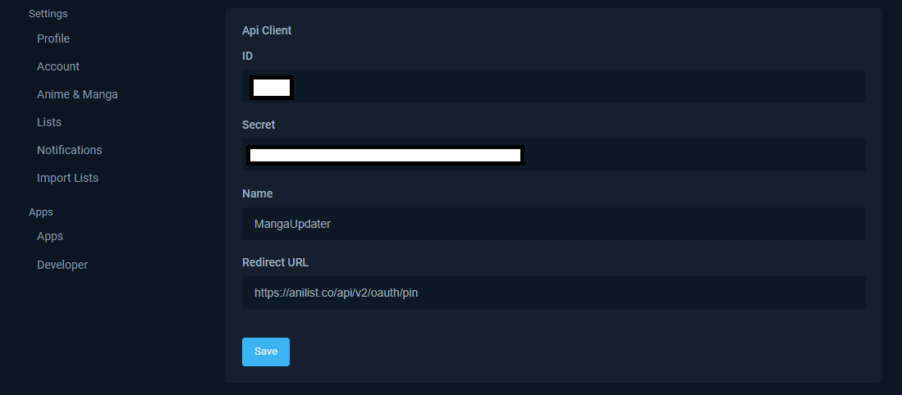

# Installation

1. You will need to set up an API in Anilist connected to your account. (In Settings under the developer tab)
   * Name the new client whatever you would like, I chose "MangaUpdater"
   * Set the redirect URL to "[https://anilist.co/api/v2/oauth/pin](https://anilist.co/api/v2/oauth/pin)"
   * A benefit to each person making their API client is that as long as none of the authentication information is shared, you are the sole person who has access to the account with that authentication
2. When running the program it will ask you for the following client ID and secret values generated from the API client. (They are saved to the config.json file)
   * DO NOT share the ID or Secret values, someone can get full access to your account.
3. The script may need you to reauthenticate if the token is invalid.

<figure><figcaption>
<code>Anilist</code> API Settings
</figcaption></figure>
