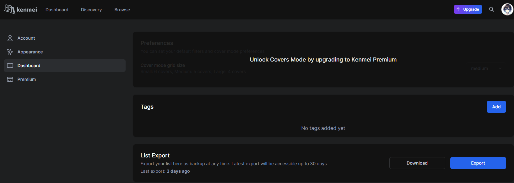

# Prerequisites

## Getting List from [Kenmei](https://www.kenmei.co)

Before you start, you need to export your list from [Kenmei](https://www.kenmei.co) as a .csv file.

1.  In settings under the dashboard you can export your list as a .csv file.&#x20;

    <figure><figcaption>
<code>Kenmei</code> Export
</figcaption></figure>
2. Import this file into the program with the browse button&#x20;
   * (Optional) There is a second button for a "Previous" export file. This is for if you have already run the program before, import the previous export file as the file you used last time and your current one as the one you want to run now. This will find the difference between the 2 and only update what was different.&#x20;
     * This speeds up the program a lot, however, you need to have run the program once before to do this.
