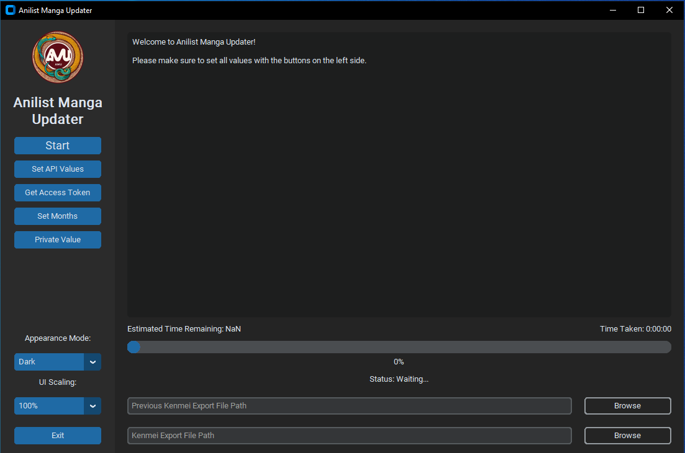

# Usage

<figure><figcaption>
<code>GUI.py</code> GUI At Startup
</figcaption></figure>

Currently, I use this script to update my manga list from my [Kenmei](https://www.kenmei.co/) account. If you have any features you would like added, please let me know.

The script outputs 3 different text files when finished.

* One which has manga that was found to have multiple different IDs associated with it. (usually due to the name being found as a direct match in English or Romaji and others which has matches in synonyms)
  * This file also gives the Anilist links to the manga so that they can be individually checked.
* The second one is manga which was found to not have any English, Romaji, or synonym name matches. (Most times this is due to translations of titles being different from the input sources and Anilist)
  * You can then search these names separately on Anilist to see if you can get any results.
* The third is in a sub directory which keeps track of how many chapters are updated each time you run the program.
